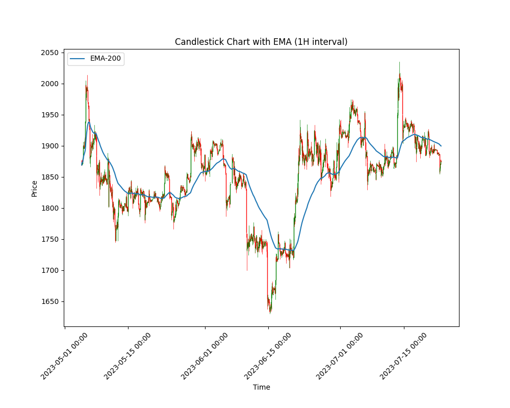

# Описание
Сервис создает свечной график и рассчитывает экспоненциальную скользящую 
среднюю (EMA) на основе данный сделок из `.csv` файла.


- Чтение сделок: сервис читает сделки из предоставленного файла CSV. 
Файл должен содержать следующие столбцы: Временная метка, Цена.
- Формирование свечей: агрегирование сделок в свечи на основе предоставленного 
временного интервала (например, 5 минут, 1 час). Свечи включают значения 
Open, High, Low, Close.
- Расчет EMA: расчета экспоненциальной скользящей средней (EMA) заданной длины 
(например, 14 периодов).


### Запуск сервиса

- Установите и активируйте виртуальное окружение
- Установите зависимости из файла requirements.txt

```
pip install -r requirements.txt
``` 

- Выполните команду:

```
python main.py
```

В терминале будет предложено вести:
- имя `.csv` файла с данными сделок
- интервал свечей
- количество периодов EMA

Сервис сохранит результаты в файл `result.csv`

```text
Timestamp,Open,High,Low,Close,EMA
2023-05-04 18:21:18.340,1875.979748793,2005.2157656006,1869.0165488903,1993.3529547787,1993.3529547787
2023-05-05 18:21:18.340,1993.6033251902,2013.9876735985,1866.590305501,1889.3380157933,1941.0854479385364
2023-05-06 18:21:18.340,1889.4551407711,1933.9215903944,1888.843641037,1917.2130446888,1933.048273550885
2023-05-07 18:21:18.340,1916.4811842981,1922.2356624169,1820.0381661699,1834.3236988856,1907.9956848733677
2023-05-08 18:21:18.340,1833.9462523384,1858.7245551962,1830.0217926184,1849.1778277673,1895.9956716010422
2023-05-09 18:21:18.340,1849.1873292652,1888.039017213,1801.1189318193,1839.5391683069,1886.3494586665568
2023-05-10 18:21:18.340,1838.9425230112,1862.8226090109,1778.0518880845,1782.0266221175,1870.9953915971137
...
```

Также выводится полученный график



### Тестирование

```
python -m unittest discover -s tests -p "test_*.py"
```
